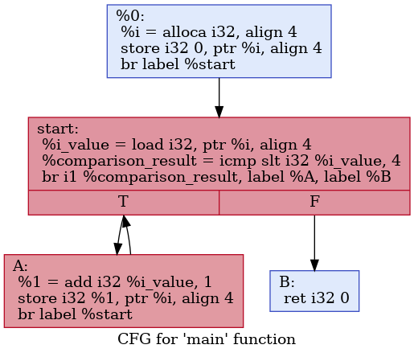

# 控制语句

## 汇编层面的控制语句

在大多数语言中，常见的控制语句主要有四种：

* `if` .. `else`
* `for`
* `while`
* `switch`

在汇编语言层面，控制语句则被分解为两种核心的指令：条件跳转与无条件跳转（`switch`其实还有一些工作，之后会提到）。我们下面分别来看看在汇编层面是怎样实现控制语句的。

### `if` .. `else`

我们有以下C代码：

```c
if (a > b) {
    // Do something A
} else {
    // Do something B
}
// Do something C
```

为了将这个指令改写成汇编指令，我们同时需要条件跳转与无条件跳转。我们用伪代码表示其汇编指令为：

```pseudocode
    Compare a and b
    Jump to label B if comparison is a is not greater than b // conditional jump
label A:
    Do something A
    Jump to label C // unconditional jump
label B:
    Do something B
label C:
    Do something C
```

汇编语言通过条件跳转、无条件跳转和三个标签（`label A`标签实际上没有作用，只不过让代码更加清晰）实现了高级语言层面的`if` .. `else`语句。

### `for`

我们有以下C代码：

```c
for (int i = 0; i < 4; i++) {
    // Do something A
}
// Do something B
```

为了将这个指令改写为汇编指令，我们同样地需要条件跳转与无条件跳转：

```pseudocode
    int i = 0
label start:
    Compare i and 4
    Jump to label B if comparison is i is not less than 4 // conditional jump
label A:
    Do something A
    i++
    Jump to label start // unconditional jump
label B:
    Do something B
```

而`while`与`for`则极其类似，只不过少了初始化与自增的操作，这里不再赘述。

根据我们在汇编语言中积累的经验，我们得出，要实现大多数高级语言的控制语句，我们需要四个东西：

* 标签
* 无条件跳转
* 比较大小的指令
* 条件跳转

## LLVM IR层面的控制语句

下面就以我们上面的`for`循环的C语言版本为例，解释如何写其对应的LLVM IR语句。

首先，我们对应的LLVM IR的基本框架为

```llvm
%i = alloca i32                       ; int i = ...
store i32 0, ptr %i                   ; ... = 0
%i_value = load i32, ptr %i
; Do something A
%1 = add i32 %i_value, 1              ; ... = i + 1
store i32 %1, ptr %i                  ; i = ...
; Do something B
```

这个程序缺少了一些必要的步骤，而我们之后会将其慢慢补上。

### 标签

在LLVM IR中，标签与汇编语言的标签一致，也是以`:`结尾作标记。我们依照之前写的汇编语言的伪代码，给这个程序加上标签：

```llvm
    %i = alloca i32                  ; int i = ...
    store i32 0, ptr %i              ; ... = 0
start:
    %i_value = load i32, ptr %i
A:
    ; Do something A
    %1 = add i32 %i_value, 1         ; ... = i + 1
    store i32 %1, ptr %i             ; i = ...
B:
    ; Do something B
```

### 比较指令

LLVM IR提供的比较指令为`icmp`。其接受三个参数：比较方案以及两个比较参数。这样讲比较抽象，我们就来看一下一个最简单的比较指令的例子：

```llvm
%comparison_result = icmp uge i32 %a, %b
```

这个例子转化为C++语言就是

```c++
bool comparison_result = ((unsigned int)a >= (unsigned int)b);
```

这里，`uge`是比较方案，`%a`和`%b`就是用来比较的两个数，而`icmp`则返回一个`i1`类型的值，也就是C++中的`bool`值，用来表示结果是否为真。

`icmp`支持的比较方案很广泛：

* 首先，最简单的是`eq`与`ne`，分别代表相等或不相等。
* 然后，是无符号的比较`ugt`, `uge`, `ult`, `ule`，分别代表大于、大于等于、小于、小于等于。我们之前在数的表示中提到，LLVM IR中一个整型变量本身的符号是没有意义的，而是需要看在其参与的指令中被看作是什么符号。这里每个方案的`u`就代表以无符号的形式进行比较。
* 最后，是有符号的比较`sgt`, `sge`, `slt`, `sle`，分别是其无符号版本的有符号对应。

我们来看加上比较指令之后，我们的例子就变成了：

```llvm
    %i = alloca i32                               ; int i = ...
    store i32 0, ptr %i                           ; ... = 0
start:
    %i_value = load i32, ptr %i
    %comparison_result = icmp slt i32 %i_value, 4 ; Test if i < 4
A:
    ; Do something A
    %1 = add i32 %i_value, 1                      ; ... = i + 1
    store i32 %1, ptr %i                          ; i = ...
B:
    ; Do something B
```

### 条件跳转

在比较完之后，我们需要条件跳转。我们来看一下我们此刻的目的：若`%comparison_result`是`true`，那么跳转到`A`，否则跳转到`B`。

LLVM IR为我们提供的条件跳转指令是`br`，其接受三个参数，第一个参数是`i1`类型的值，用于作判断；第二和第三个参数分别是值为`true`和`false`时需要跳转到的标签。比方说，在我们的例子中，就应该是

```llvm
br i1 %comparison_result, label %A, label %B
```

我们把它加入我们的例子：

```llvm
    %i = alloca i32                               ; int i = ...
    store i32 0, ptr %i                           ; ... = 0
start:
    %i_value = load i32, ptr %i
    %comparison_result = icmp slt i32 %i_value, 4 ; Test if i < 4
    br i1 %comparison_result, label %A, label %B
A:
    ; Do something A
    %1 = add i32 %i_value, 1                      ; ... = i + 1
    store i32 %1, ptr %i                          ; i = ...
B:
    ; Do something B
```

### 无条件跳转

无条件跳转更好理解，直接跳转到某一标签处。在LLVM IR中，我们同样可以使用`br`进行条件跳转。如，如果要直接跳转到`start`标签处，则可以

```llvm
br label %start
```

我们也把这加入我们的例子：

```llvm
    %i = alloca i32                               ; int i = ...
    store i32 0, ptr %i                           ; ... = 0
start:
    %i_value = load i32, ptr %i
    %comparison_result = icmp slt i32 %i_value, 4 ; Test if i < 4
    br i1 %comparison_result, label %A, label %B
A:
    ; Do something A
    %1 = add i32 %i_value, 1                      ; ... = i + 1
    store i32 %1, ptr %i                          ; i = ...
    br label %start
B:
    ; Do something B
```

这样看上去就结束了，然而如果大家把这个代码交给`llc`的话，并不能编译通过，这是为什么呢？

### Basic block

首先，我们来摘录一下LLVM IR的参考指南中[Functions](http://llvm.org/docs/LangRef.html#functions)节的一段话：

> A function definition contains a list of basic blocks, forming the CFG (Control Flow Graph) for the function. Each basic block may optionally start with a label (giving the basic block a symbol table entry), contains a list of instructions, and ends with a terminator instruction (such as a branch or function return). If an explicit label name is not provided, a block is assigned an implicit numbered label, using the next value from the same counter as used for unnamed temporaries (see above).

这段话的大意有几个：

* 一个函数由许多基本块(Basic block)组成
* 每个基本块包含：
   * 开头的标签（可省略）
   * 一系列指令
   * 结尾是终结指令
* 一个基本块没有标签时，会自动赋给它一个标签

所谓终结指令，就是指改变执行顺序的指令，如跳转、返回等。

我们来看看我们之前写好的程序是不是符合这个规定。`start`开头的基本块，在一系列指令后，以

```llvm
br i1 %comparison_result, label %A, label %B
```

结尾，是一个终结指令。`A`开头的基本块，在一系列指令后，以

```llvm
br label %start
```

结尾，也是一个终结指令。`B`开头的基本块，在最后总归是需要函数返回的（这里为了篇幅省略了），所以也一定会带有一个终结指令。

看上去都很符合呀，那为什么编译不通过呢？我们来仔细想一下，我们考虑了所有基本块了吗？要注意到，一个基本块是可以没有名字的，所以，实际上还有一个基本块没有考虑到，就是函数开头的：

```llvm
%i = alloca i32          ; int i = ...
store i32 0, ptr %i      ; ... = 0
```

这个基本块。它并没有以终结指令结尾！

所以，我们把一个终结指令补充在这个基本块的结尾：

```llvm
    %i = alloca i32                               ; int i = ...
    store i32 0, ptr %i                           ; ... = 0
    br label %start
start:
    %i_value = load i32, ptr %i
    %comparison_result = icmp slt i32 %i_value, 4 ; Test if i < 4
    br i1 %comparison_result, label %A, label %B
A:
    ; Do something A
    %1 = add i32 %i_value, 1                      ; ... = i + 1
    store i32 %1, ptr %i                          ; i = ...
    br label %start
B:
    ; Do something B
```

这样就完成了我们的例子，大家可以在本系列的GitHub的仓库中查看对应的代码`for.ll`。

### 可视化

LLVM的工具链甚至为我们提供了可视化控制语句的方法。我们使用之前提到的LLVM工具链中用于优化的`opt`工具：

```shell
opt -p dot-cfg for.ll
```

然后会生成一个`.main.dot`的文件。如果我们在计算机上装有[Graphviz](http://www.graphviz.org)，那么就可以用

```shell
dot .main.dot -Tpng -o for.png
```

生成其可视化的控制流图（CFG）：



### `switch`

下面我们来讲讲`switch`语句。我们有以下C语言程序：

```c
int x;
switch (x) {
    case 0:
        // do something A
        break;
    case 1:
        // do something B
        break;
    default:
        // do something C
        break;
}
// do something else
```

我们先直接来看其转换成LLVM IR是什么样子的：

```llvm
switch i32 %x, label %C [
    i32 0, label %A
    i32 1, label %B
]
A:
    ; Do something A
    br label %end
B:
    ; Do something B
    br label %end
C:
    ; Do something C
    br label %end
end:
    ; Do something else
```

其核心就是第一行的`switch`指令。其第一个参数`i32 %x`是用来判断的，也就是我们C语言中的`x`。第二个参数`label %C`是C语言中的`default`分支，这是必须要有的参数。也就是说，我们的`switch`必须要有`default`来处理。接下来是一个数组，其意义已经很显然了，如果`%x`值是`0`，就去`label %A`，如果值是`1`，就去`label %B`。

LLVM后端对`switch`语句具体到汇编层面的实现则通常有两种方案：用一系列条件语句或跳转表。

一系列条件语句的实现方式最简单，用伪代码来表示的话就是

```pseudocode
if (x == 0) {
    Jump to label %A
} else if (x == 1) {
    Jump to label %B
} else {
    Jump to label %C
}
```

这是十分符合常理的。然而，我们需要注意到，如果这个`switch`语句一共有n个分支，那么其查找效率实际上是O(n)。那么，这种实现方案下的`switch`语句仅仅是`if` .. `else`的语法糖，除了增加可维护性，并不会优化什么性能。

跳转表则是一个可以优化性能的`switch`语句实现方案，其伪代码为：

```pseudocode
labels = [label %A, label %B]
if (x < 0 || x > 1) {
    Jump to label %C
} else {
    Jump to labels[x]
}
```

这只是一个极其粗糙的近似的实现，我们需要的是理解其基本思想。跳转表的思想就是利用内存中数组的索引是O(1)复杂度的，所以我们可以根据目前的`x`值去查找应该跳转到哪一个地址，这就是跳转表的基本思想。

根据目标平台和`switch`语句的分支数，LLVM后端会自动选择不同的实现方式去实现`switch`语句。

### `select`

我们经常会遇到一种情况，某一变量的值需要根据条件进行赋值，比如说以下C语言的函数：

```c
void foo(int x) {
    int y;
    if (x > 0) {
        y = 1;
    } else {
        y = 2;
    }
    // Do something with y
}
```

如果`x`大于`0`，则`y`为`1`，否则`y`为`2`。这一情况很常见，然而在C语言中，如果要实现这种功能，`y`需要被实现为可变变量，但实际上无论`x`如何取值，`y`只会被赋值一次，并不应该是可变的。

我们知道，LLVM IR中，由于SSA的限制，局部可变变量都必须分配在栈上，虽然LLVM后端最终会进行一定的优化，但写起代码来还需要冗长的`alloca`, `load`, `store`等语句。如果我们按照C语言的思路来写LLVM IR，那么就会是：

```llvm
define void @foo(i32 %x) {
    %y = alloca i32
    %1 = icmp sgt i32 %x, 0
    br i1 %1, label %btrue, label %bfalse
btrue:
    store i32 1, ptr %y
    br label %end
bfalse:
    store i32 2, ptr %y
    br label %end
end:
    ; do something with %y
    ret void
}
```

我们来看看其编译出的汇编语言是怎样的：

```assembly
foo:
# %bb.0:
	cmpl	$0, %edi
	jle	.LBB0_2
# %bb.1:                                # %btrue
	movl	$1, -4(%rsp)
	jmp	.LBB0_3
.LBB0_2:                                # %bfalse
	movl	$2, -4(%rsp)
.LBB0_3:                                # %end
	retq
```

算上注释，C语言代码9行，汇编语言代码11行，LLVM IR代码14行。这LLVM IR同时比低层次和高层次的代码都长，这显然是不可以接受的。究其原因，就是这里把`y`看成了可变变量。那么，有没有什么办法让`y`不可变但仍然能实现这个功能呢？

首先，我们来看看同样区分可变变量与不可变变量的Rust是怎么做的：

```rust,ignore
fn foo(x: i32) {
    let y = if x > 0 { 1 } else { 2 };
    // Do something with y
}
```

让代码简短的方式很简单，把`y`看作不可变变量，但同时需要语言支持把`if`语句视作表达式，当`x`大于`0`时，这个表达式返回`1`，否则返回`2`。这样，就很简单地实现了我们的需求。

LLVM IR中同样也有这样的指令，那就是`select`，我们来把上面的例子用`select`改写：

```llvm
define void @foo(i32 %x) {
    %result = icmp sgt i32 %x, 0
    %y = select i1 %result, i32 1, i32 2
    ; Do something with %y
}
```

`select`指令接受三个参数。第一个参数是用来判断的布尔值，也就是`i1`类型的`icmp`判断的结果，如果其为`true`，则返回第二个参数，否则返回第三个参数。极其合理。

### `phi`

`select`只能支持两个选择，`true`选择一个分支，`false`选择另一个分支，我们是不是可以有支持多种选择的类似`switch`的版本呢？同时，我们也可以换个角度思考，`select`是根据`i1`的值来进行判断，我们其实可以根据控制流进行判断。这就是在SSA技术中大名鼎鼎的`phi`指令。

为了方便起见，我们首先先来看用`phi`指令实现的我们上面这个代码：

```llvm
define void @foo(i32 %x) {
    %result = icmp sgt i32 %x, 0
    br i1 %result, label %btrue, label %bfalse
btrue:
    br label %end
bfalse:
    br label %end
end:
    %y = phi i32 [1, %btrue], [2, %bfalse]
    ; Do something with %y
    ret void
}
```

我们看到，`phi`的第一个参数是一个类型，这个类型表示其返回类型为`i32`。接下来则是两个数组，其表示，如果当前的basic block执行的时候，前一个basic block是`%btrue`，那么返回`1`，如果前一个basic block是`%bfalse`，那么返回`2`。

也就是说，`select`是根据其第一个参数`i1`类型的变量的值来决定返回哪个值，而`phi`则是根据其之前是哪个basic block来决定其返回值。此外，`phi`之后可以跟无数的分支，如`phi i32 [1, %a], [2, %b], [3, %c]`等，从而可以支持多分支的赋值。
