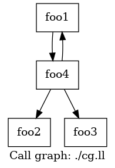

# 函数

这篇文章我们来讲函数。有过汇编基础的同学都知道，在汇编层面，一个函数与一个控制语句极其相似，都是由标签组成，只不过在跳转时增加了一些附加的操作。而在LLVM IR层面，函数则得到了更高一层的抽象。

## 定义与声明

### 函数定义

在LLVM中，一个最基本的函数定义的样子我们之前已经遇到过多次，就是`@main`函数的样子：

```llvm
define i32 @main() {
    ret i32 0
}
```

在函数名之后可以加上参数列表，如：

```llvm
define i32 @foo(i32 %a, i64 %b) {
    ret i32 0
}
```

一个函数定义最基本的框架，就是返回值（`i32`）+函数名（`@foo`）+参数列表（`(i32 %a, i64 %b）`）+函数体（`{ ret i32 0 }`）。

我们可以看到，函数的名称和全局变量一样，都是以`@`开头的。并且，如果我们查看符号表的话，也会发现其和全局变量一样进入了符号表。因此，函数也有和全局变量完全一致的Linkage Types和Visibility Style，来控制函数名在符号表中的出现情况，因此，可以出现如

```llvm
define private i32 @foo() {
    ; ...
}
```

这样的修饰符。

#### 属性

此外，我们还可以在参数列表之后加上属性，也就是控制优化器和代码生成器的指令。如果我们单纯编译一个简单的C代码：

```c
void foo() {}
```

其编译出的LLVM IR实际上是

```llvm
define dso_local void @foo() #0 {
  ret void
}

attributes #0 = { noinline nounwind optnone uwtable "frame-pointer"="all" "min-legal-vector-width"="0" "no-trapping-math"="true" "stack-protector-buffer-size"="8" "target-cpu"="x86-64" "target-features"="+cx8,+fxsr,+mmx,+sse,+sse2,+x87" "tune-cpu"="generic" }
```

这里的`#0`就是一个属性组，其包含了`noinline`、`nounwind`等若干个函数的属性。这些属性可以控制LLVM在优化和生成函数时的行为。大部分的属性可以在[Function Attributes](http://llvm.org/docs/LangRef.html#function-attributes)一节看到。

当函数的属性比较少时，我们可以直接把属性写在函数定义后面，而不用以属性组的形式来写。例如下面这两种写法都是对的：

```llvm
define void @foo() nounwind { ret void }
; or
define void @foo() #0 { ret void }
attributes #0 {
    nounwind ; ...
}
```

我们知道，无论是在代码编译还是在程序分析的过程中，我们最常处理的都在函数级别。因此，属性在这一过程中就是一个非常关键的概念。我们在编译器前端分析的过程中，遇到了特定的函数，给它加上相应的属性；在编译器后端生成代码时，则判断当前函数是否有相应的属性，从而可以在编译器前后端之间传递信息。

### 函数声明

除了函数定义之外，还有一种情况十分常见，那就是函数声明。我们在一个编译单元（模块）下，可以使用别的模块的函数，这时候就需要在本模块先声明这个函数，才能保证编译时不出错，从而在链接时正确将声明的函数与别的模块下其定义进行链接。

函数声明也相对比较简单，就是使用`declare`关键词替换`define`：

```llvm
declare i32 @printf(i8*, ...) #1
```

这个就是在C代码中调用`stdio.h`库的`printf`函数时，在LLVM IR代码中可以看到的函数声明，其中`#1`就是又一大串属性组成的属性组。

## 函数的调用

在LLVM IR中，函数的调用与高级语言几乎没有什么区别：

```llvm
define i32 @foo(i32 %a) {
    ; ...
}

define void @bar() {
    %1 = call i32 @foo(i32 1)
}
```

使用`call`指令可以像高级语言那样直接调用函数。我们来仔细分析一下这里做了哪几件事：

* 传递参数
* 执行函数
* 获得返回值

居然能干这么多事，这是汇编语言所羡慕不已的。

### 执行函数

我们知道，如果一个函数没有任何参数，返回值也是`void`类型，也就是说在C语言下这个函数是

```c
void foo(void) {
    // ...
}
```

那么调用这个函数就没有了传递参数和获得返回值这两件事，只剩下执行函数，而这是一个最简单的事，以AMD64架构为例：

1. 把函数返回地址压栈
2. 跳转到相应函数的地址

函数返回也是一个最简单的事：

1. 弹栈获得函数返回地址
2. 跳转到相应的返回地址

这个在我们的汇编语言基础中已经反复遇到过多次，相信大家都会十分熟练。

### 传递参数与获得返回值

谈到这两点，就不得不说调用约定了。我们知道，在汇编语言中，是没有参数传递和返回值的概念的，有的仅仅是让当前的控制流跳转到指定函数执行。所以，一切的参数传递和返回值都需要我们人为约定。也就是说，我们需要约定两件事：

* 被调用的函数希望知道参数是放在哪里的
* 调用者希望知道调用函数的返回值是放在哪里的

这就是调用约定。不同的调用约定会产生不同的特效，也就产生了许多高级语言的feature。

#### C调用约定

最广泛使用的调用约定是C调用约定，也就是各个操作系统的标准库使用的调用约定。在AMD64架构下，C调用约定是System V版本的，所有参数按顺序放入指定寄存器，如果寄存器不够，剩余的则从右往左顺序压栈。而返回值则是按先后顺序放入寄存器或者放入调用者分配的空间中，如果只有一个返回值，那么就会放在`rax`里。

在LLVM IR中，函数的调用默认使用C调用约定。为了验证，我们可以写一个简单的程序：

```llvm
; calling_convention_test.ll
%ReturnType = type { i32, i32 }
define %ReturnType @foo(i32 %a1, i32 %a2, i32 %a3, i32 %a4, i32 %a5, i32 %a6, i32 %a7, i32 %a8) {
    ret %ReturnType { i32 1, i32 2 }
}

define i32 @main() {
    %1 = call %ReturnType @foo(i32 1, i32 2, i32 3, i32 4, i32 5, i32 6, i32 7, i32 8)
    ret i32 0
}
```

我们查看其编译出来的汇编代码。在`main`函数中，参数传递是：

```x86asm
movl    $1, %edi
movl    $2, %esi
movl    $3, %edx
movl    $4, %ecx
movl    $5, %r8d
movl    $6, %r9d
movl    $7, (%rsp)
movl    $8, 8(%rsp)
callq   foo@PLT
```

而在`foo`函数内部，返回值传递是：

```x86asm
movl    $1, %eax
movl    $2, %edx
retq
```

如果大家去查阅System V的指南的话，会发现完全符合。

这种System V的调用约定有什么好处呢？其最大的特点在于，当寄存器数量不够时，剩余的参数是按**从右向左**的顺序压栈。这就让基于这种调用约定的高级语言可以更轻松地实现可变参数的feature。所谓可变参数，最典型的例子就是C语言中的`printf`：

```c
printf("%d %d %d %d", a, b, c, d);
```

`printf`可以接受任意数量的参数，其参数的数量是由第一个参数`"%d %d %d %d"`决定的。有多少个需要格式化的变量，接下来就还有多少个参数。

那么，System V的调用约定又是为什么能满足这样的需求呢？假设我们不考虑之前传入寄存器内的参数，只考虑压入栈内的参数。那么，如果是从右往左的顺序压栈，栈顶就是`"%d %d %d %d"`的地址，接着依次是`a`, `b`, `c`, `d`。那么，我们的程序就可以先读栈顶，获得字符串，然后确定有多少个参数，接着就继续在栈上读多少个参数。相反，如果是从左往右顺序压栈，那么程序第一个读到的是`d`，程序也不知道该读多少个参数。

#### fastcc

各种语言的调用约定还有许多，可以参考语言指南的[Calling Conventions](http://llvm.org/docs/LangRef.html#calling-conventions)一节。把所有的调用约定都讲一遍显然是不可能且枯燥的。所以，我在这里除了C调用约定之外，只再讲一个调用约定fastcc，以体现不同的调用约定能实现不同的高级语言的feature。

fastcc方案是将变量全都传入寄存器中的方案。这种方案使尾调用优化能更方便地实现。

尾调用会出现在很多场景下，用一个比较平凡的例子：

```c
int foo(int a) {
    if (a == 1) {
        return 1;
    } else {
        return foo(a - 1);
    }
}
```

我们注意到，这个函数在返回时有可能会调用自身，这就叫尾调用。为什么尾调用需要优化呢？我们知道，在正常情况下，调用一个函数会产生函数的栈帧，也就是把函数的参数传入栈，把函数的返回地址传入栈。那么如果`a`很大，那么调用的函数会越来越多，并且直到最后一个被调用的函数返回之前，所有调用的函数的栈都不会回收，也就是说，我们此时栈上充斥着一层一层被调用函数返回的地址。

然而，由于这个函数是在调用者的返回语句里调用，我们实际上可以复用调用者的栈，这就是尾调用优化的基础思想。我们希望，把这样的尾调用变成循环，从而减少栈的使用。通过将参数都传入寄存器，我们可以避免再将参数传入栈，这就是fastcc为尾调用优化提供的帮助。然后，就可以直接将函数调用变成汇编中的`jmp`。

我们来看如果用fastcc调用约定，LLVM IR该怎么写：

```llvm
; tail_call_test.ll
define fastcc i32 @foo(i32 %a) {
    %res = icmp eq i32 %a, 1
    br i1 %res, label %btrue, label %bfalse
btrue:
    ret i32 1
bfalse:
    %sub = sub i32 %a, 1
    %tail_call = tail call fastcc i32 @foo(i32 %sub)
    ret i32 %tail_call
}
```

我们使用`llc`对其编译，并加上`-tailcallopt`的指令（实际上不加也没关系，LLVM后端会自动进行[Sibling call optimization](http://llvm.org/docs/CodeGenerator.html#sibling-call-optimization)）：

```shell
llc tail_call_test.ll -tailcallopt
```

其编译而成的汇编代码中，其主体为：

```x86asm
foo:
    cmpl    $1, %edi
    jne     .LBB0_2
    movl    $1, %eax
    retq    $8
.LBB0_2:
    pushq   %rax
    decl    %edi
    popq    %rax
    jmp     foo@PLT
```

我们可以发现，在结尾，使用的是`jmp`而不是`call`，所以从高级语言的角度，就可以看作其将尾部的调用变成了循环。并且，有两个操作：`pushq    %rax`和`popq    %rax`。这两个操作只是为了栈对齐，具体可以参考stack overflow上的回答[Why does this function push RAX to the stack as the first operation?](https://stackoverflow.com/a/45823778/10005095)。

## 可视化

与控制语句的可视化类似，我们也可以通过LLVM工具链，获得LLVM IR的函数调用图（Call Graph）。

假设我们有以下LLVM IR:

```llvm
; cg.ll
define void @foo1() {
  call void @foo4(i32 0)
  ret void
}

declare void @foo2()
declare void @foo3()

define void @foo4(i32 %0) {
  %comparison_result = icmp sgt i32 %0, 0
  br i1 %comparison_result, label %true_branch, label %false_branch

true_branch:
  call void @foo1()
  br label %final

false_branch:
  call void @foo2()
  br label %final

final:
  call void @foo3()
  ret void
}
```

`foo4`根据输入，调用`foo1`或者`foo2`，最终调用`foo3`。而`foo1`则递归调用`foo4`。

对于这样的LLVM IR，我们使用

```shell
opt -p dot-callgraph cg.ll
```

可以生成一个`cg.ll.callgraph.dot`的文件。类似CFG，我们可以使用

```shell
dot cg.ll -Tpng -o cg.png
```

生成如下图所示的函数调用图：



### 帧指针清除优化

最后，再讲一个函数调用中的优化，就是帧指针清除优化（Frame Pointer Elimination）。

在讲这个之前，先讲一个比较小的优化。我们将一个非常简单的C程序

```c
void foo(int a, int b) { }
int main() {
    foo(1, 2);
    return 0;
}
```

编译为汇编程序，可以发现，`foo`函数的汇编代码为：

```x86asm
foo:
    pushq   %rbp
    movq    %rsp, %rbp
    movl    %edi, -4(%rbp)
    movl    %esi, -8(%rbp)
    popq    %rbp
```

与我们常识有些违背。为啥这里栈不先增加（也就是对`rsp`寄存器进行`sub`），就直接把`edi`, `esi`的值移入栈内了呢？`-4(%rbp)`和`-8(%rbp)`的内存空间此刻似乎并不属于栈。

这是因为，在System V关于amd64架构的标准中，规定了`rsp`以下128个字节为red zone。这个区域，信号和异常处理函数均不会使用。因此，一个函数可以放心使用`rsp`以下128个字节的内容。

同时，我们对栈指针进行操作，一个很重要的原因就是为了进一步函数调用的时候，使用`call`指令会自动将被调用函数的返回地址压栈，那么就需要在调用`call`指令之前，保证栈顶指针确实指向栈顶，否则压栈就会覆盖一些数据。

但此时，我们的`foo`函数并没有调用别的函数，也就不会产生压栈行为。因此，如果在栈帧不超过128个字节的情况下，编译器自动为我们省去了这样的操作。为了验证这一点，我们做一个小的修改：

```c
void bar() { }
void foo(int a, int b) { bar(); }
int main() {
    foo(1, 2);
    return 0;
}
```

这时，我们再看编译出的`foo`函数的汇编代码：

```x86asm
foo:
    pushq   %rbp
    movq    %rsp, %rbp
    subq    $16, %rsp
    movl    %edi, -4(%rbp)
    movl    %esi, -8(%rbp)
    callq   bar
    addq    $16, %rsp
    popq    %rbp
    retq
```

确实增加了对`rbp`的`sub`和`add`操作。而此时的`bar`函数，也没有对`rsp`的操作。

接下来，就要讲帧指针清除优化了。经过我们上述的讨论，一个函数在进入时会有一些固定动作：

1. 把`rbp`压栈
2. 把`rsp`放入`rbp`
3. 减`rsp`，预留栈空间

在函数返回之前，也有其相应的操作：

1. 加`rsp`，回收栈空间
2. 把`rbp`最初的值弹栈回到`rbp`

我们刚刚讲的优化，使得没有调用别的函数的函数，可以省略掉进入时的第3步和返回前的第1步。那么，是否还可以继续省略呢？

那么，我们就要考虑为什么需要这些步骤。这些步骤都是围绕`rbp`进行的，而正是因为`rbp`经常进行这种操作，所以我们把`rbp`称为帧指针。之所以要进行这些操作，是因为我们在函数执行的过程中，栈顶指针随着不断调用别的函数，会不断移动，导致我们根据栈顶指针的位置，不太方便确定局部变量的位置。而如果我们在一开始就把`rsp`的值放在`rbp`中，那么局部变量的位置相对`rbp`是固定的，就更好确认了。注意到我们这里说根据`rsp`的值确认局部变量的位置只是不方便，但并不是不能做到。所以，我们可以增加一些编译器的负担，而把帧指针清除。

帧指针清除在LLVM IR层面其实十分方便，就是什么都不写。我们可以观察

```llvm
define void @foo(i32 %a, i32 %b) {
    %1 = alloca i32
    %2 = alloca i32
    store i32 %a, ptr %1
    store i32 %b, ptr %2
    ret void
}
```

这个函数在编译成汇编语言之后，是：

```x86asm
foo:
    movl    %edi, -4(%rsp)
    movl    %esi, -8(%rsp)
    retq
```

不仅没有了栈的增加减少（之前提过的优化），也没有了对`rbp`的操作（帧指针清除）。

要想恢复这一操作也十分简单，在函数参数列表后加上一个属性`"frame-pointer"="all"`：

```llvm
define void @foo(i32 %a, i32 %b) "frame-pointer"="all" {
    %1 = alloca i32
    %2 = alloca i32
    store i32 %a, ptr %1
    store i32 %b, ptr %2
    ret void
}
```

其编译后的汇编程序就是：

```x86asm
foo:
    pushq   %rbp
    movq    %rsp, %rbp
    movl    %edi, -4(%rbp)
    movl    %esi, -8(%rbp)
    popq    %rbp
    retq
```

恢复了往日的雄风。
